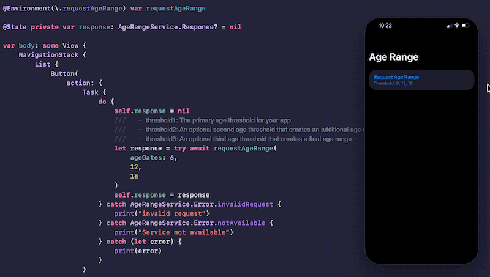

# SwiftUI_AgeRangeDemo
A demo of requesting for user age range and interpreting the response.

For more details, please refer to my blog: [Little SwiftUI Tip: Get User Age Range In One Line!](https://medium.com/@itsuki.enjoy/little-swiftui-tip-get-user-age-range-in-one-line-0dde7c4c5ba8)

